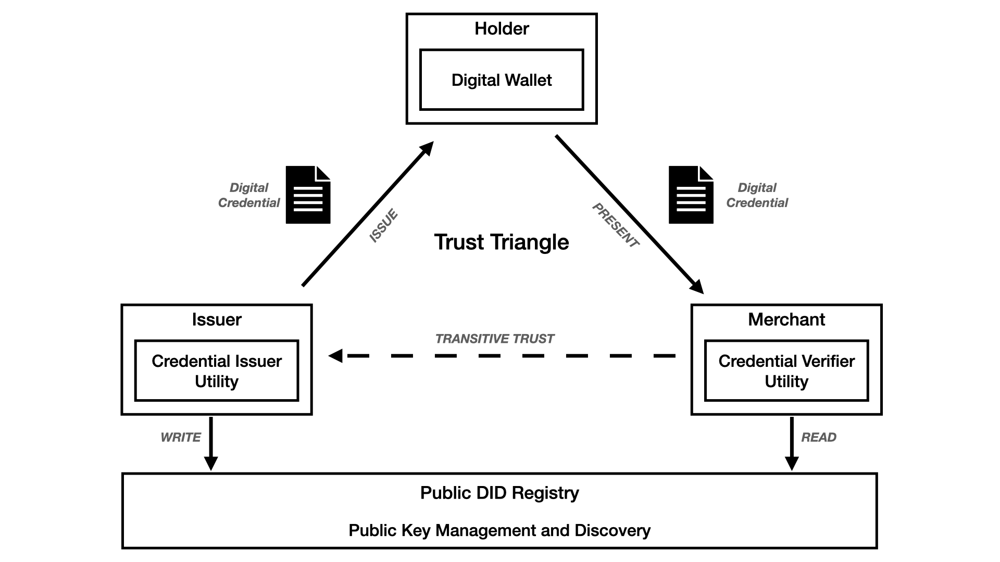

# Discover Digital Locker Recovery (DLocker)

#### Table of Contents
- [Discover Digital Locker Recovery](#discover-digital-locker-recovery) 
      - [Table of Contents](#table-of-contents)
  - [Acknowledgements](#acknowledgements)
  - [Business Challenge](#business-challenge)
    - [Concept](#concept)
    - [Approach](#approach)
  - [Vernacular](#vernacular)
  - [Assumptions](#assumptions)
  - [Persona](#persona)
  - [Story](#story)
  - [Demo Workflow](#demo-workflow)
    - [Step 1](#step-1)
    - [Step 2](#step-2)

 
## Acknowledgements

1. This scenario leverages increase in digital wallet transactions and offerings by different businesses. Discover Digital Locker Recovery is subsidiary of DFS company and is called, _D Locker_. The  DLocker logo is designed by Pranav.
2. Recovery of digital wallet idea came from Chandra who wanted to provide ways to reclaim wallet in case customer mobile is lost.
 
## Business Challenge
DLocker customer who lost there phone. Now, when they got new phone and wanted to recover Digital wallets which were store in DLocker. As of now process to restore any wallet/identity is very tailor made based on which kind of institition involved. Customer has to follow each institution guidelines to restore wallets.
 
### Concept
>DLocker uses trust triangle to recover customers digital wallets. DLocker issuer issues distributed identities for customer at time of locker account opening. Distributed identity is used for locker access and recovery.   
 
### Approach
>Template Instructions: Describe the end to end interactions of the stakeholders in the trust triangle pertinent to this use case story.

 
## Vernacular

>Template Instructions: List and describe any terms that will be used in the story and referenced in the UML diagrams. The current list provides a a sample starter list. 
 
1. **Digital Wallet**: A financial transaction application that runs on multiple device modalities (mobile, computer). These applications store, manage, and present payment and identity instruments.
3. **Merchant**: An entity involved in e-commerce trade.
4. **Checkout Platform**: An e-Commerce Payment Platform (web application) used by merchants to manage the consumer experience and the end-to-end processing of e-commerce transactions.
5. **Credential Verifier Utility**: A merchant would augment their Checkout Platform with support by a vendor solution that allows consumers to: (a) consent to a digital authentication challenge; (b) present a digital credential for identity verification.
6. **Issuer**: A entity that makes assertions about information and delivers digital credentials containing attestations about those assertions.
7. **Credential Generator**: A software component used by the Issuer to manage the generation of new digital credentials.
8. **Credential Issuer Utility**: An Issuer would augment their Credential Generator with support by a vendor solution that allows Issuers to publish a digital credential to consumers.
9. **Public Registry**: A public utility that allows for the registration and discovery of Decentralized Identifiers (DIDs).
 
## Assumptions

>Template Instructions: List any assumptions to be considered in this use case story.
 
1. Use case assumes knowledge of the W3C Standards and open source software that supports the concepts outlined by the [Trust over IP Foundation](https://trustoverip.org/toip-model/).
2. Credential Issuer and Verifier Utility solutions are readily available from 3rd party vendors.
 
## Persona

>Template Instructions: Using the sample persona images in the /images folder, describe the roles of the entities involved in this use case story. The current list provides a a sample starter list. Refer to ./HELP.md#digital-trust-use-cases for example usage.
 
| Actor | Role | Goals | Details |
| --- | --- | --- | --- |
|  | Verifier |  |  |
|   Acme Enterprise | Issuer |  |  |
|  Angelica | Consumer |  |  |
 
## Story
>Template Instructions: Using the sample persona images in the /images folder, describe the steps that are involved in the interactive use case story. Refer to ./HELP.md#digital-trust-use-cases for example usage.
 
*  Acme Enterprise decided to issue a XYZ credential. 
 
## Demo Workflow

>Template Instructions: Using the sample persona images in the /images folder, describe the steps od the use case story as they relate to the UML diagram. Refer to ./HELP.md#digital-trust-use-cases for example usage. If desired, a single diagram can be used instead of multiple steps. 
 
### Step 1
 Acme Enterprise and  register their DIDs.
 

 
### Step 2
 
 challenges  Angelica for a credential.
 

 
